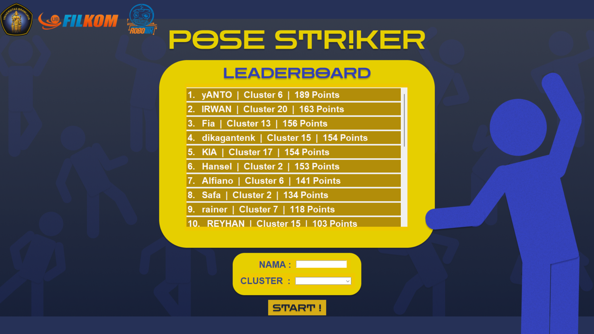

# Pose Striker - Game Deteksi Pose dengan MediaPipe Untuk OpenHouse ROBOTIIK FILKOM UB 2024



## 📌 Overview
Pose Striker adalah aplikasi game interaktif yang menggunakan computer vision untuk mendeteksi pose tubuh pemain dan membandingkannya dengan pose referensi. Aplikasi ini dikembangkan dengan Python menggunakan MediaPipe untuk pose detection dan Tkinter untuk GUI.

## 🎯 Fitur Utama
- **Deteksi Pose Real-time**: Menggunakan webcam untuk mendeteksi pose pemain
- **Sistem Poin & Combo**: Poin bertambah ketika pose cocok dengan referensi
- **Multiplier Combo**: Sistem combo untuk poin bonus
- **Fullscreen Mode**: Tampilan penuh dengan toggle F11
- **Reference Pose**: Database pose referensi untuk ditiru

## 🛠️ Teknologi yang Digunakan
- **Python 3.x**
- **OpenCV** - Computer vision dan processing gambar
- **MediaPipe** - Pose detection dan landmark extraction
- **Tkinter** - Graphical User Interface
- **Threading** - Multithreading untuk game logic

## 📁 Struktur Proyek
```
pose-striker/
├── main.py
├── assets
│   ├── Music_Game
│   ├── Music_Review
│   ├── decor
│   ├── music
│   └── reference_poses
├── camera
│   ├── __init__.py
│   └── camera_feed.py
├── game_logic/
│   ├── __init__.py
│   ├── game_logic.py
│   ├── pose_detector.py
│   └── player_manager.py
├── gui/
│   ├── __init__.py
│   ├── components.py
│   ├── game_frame.py
│   ├── game_review.py
│   └── main_menu.py
├── reference_images/
│   ├── pose1.jpg
│   ├── pose2.jpg
│   └── ...
├── requirements.txt
└── README.md
```

## 🚀 Instalasi dan Setup

### 1. Clone Repository
```bash
git clone [repository-url]
cd pose-striker
```

### 2. Install Dependencie
```bash
pip install -r requirements.txt
```

### 3. Run Aplikasi
```bash
python main.py
```

## 🎮 Cara Bermain

### Kontrol Game:
- **F11**: Toggle fullscreen mode
- **Escape**: Keluar dari fullscreen mode
- **Q**: Keluar dari aplikasi (dalam development mode)

### Aturan Game:
1. Webcam akan menangkap pose Anda
2. Pose Anda akan dibandingkan dengan pose referensi
3. Jika cocok, Anda mendapatkan poin
4. Combo bertambah jika berhasil beberapa kali berturut-turut
5. Multiplier poin meningkat dengan combo

## 📊 Game Logic

### Sistem Poin
```python
# Rumus perhitungan poin
poin = 1 * multiplier_combo
# Contoh: Jika multiplier = 3, poin yang didapat = 3
```

### Sistem Combo
- **Timeout**: 5 detik (5000ms) antara match
- **Max Combo**: 10x multiplier
- **Reset**: Combo reset jika timeout terlewati

### Pose Comparison
Aplikasi membandingkan 6 sudut kunci tubuh:
1. Left elbow (11, 13, 15)
2. Right elbow (12, 14, 16)
3. Left shoulder-hip (13, 11, 23)
4. Right shoulder-hip (14, 12, 24)
5. Shoulder-torso (11, 12, 24)
6. Shoulder-torso reverse (12, 11, 23)


## 🔍 Troubleshooting

### Masalah Umum dan Solusi

| Masalah | Penyebab | Solusi |
|---------|----------|--------|
| **Webcam tidak terdeteksi** | Camera index salah | Ubah camera feed index |
| **Pose tidak terdeteksi** | Lighting kurang | Perbaiki pencahayaan |
| **Frame rate rendah** | Hardware limit | Kurangi resolusi camera |
| **Match tidak akurat** | Threshold terlalu ketat | Adjust threshold angle |
| **Landmarks hilang** | Posisi diluar frame | Pastikan seluruh tubuh dalam frame |

### Performance Testing
- **Frame rate**: Target 30 FPS
- **Detection accuracy**: >90% dengan lighting baik
- **Response time**: <100ms dari pose ke score update

## 🐛 Bug Report & Feature Request
Jika menemukan bug atau memiliki ide fitur, silakan buat issue di repository GitHub.

**⚠️ Catatan Penting:**
- Pastikan webcam memiliki resolusi minimal 720p
- Ruangan dengan pencahayaan cukup untuk deteksi optimal
- Jarak dari webcam: 2-3 meter untuk full body capture
- Background polos meningkatkan akurasi deteksi

**🎮 Selamat Bermain!**
